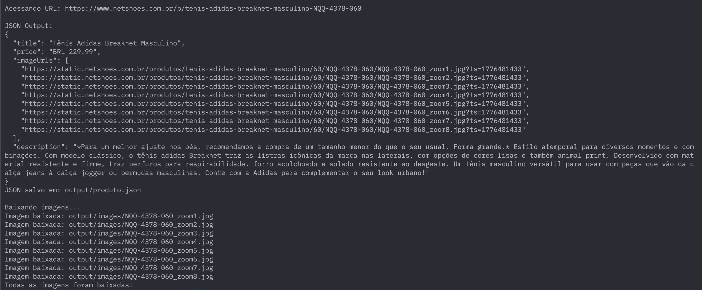
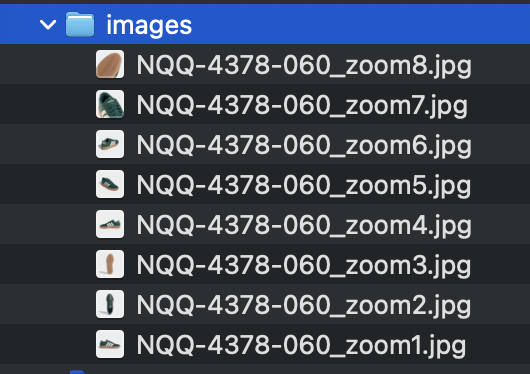

# Scraper Netshoes

Um scraper para extrair dados de produtos do site Netshoes.

## Instalação

### 1. Clone o repositório e navegue até a pasta do projeto

```bash
git clone https://github.com/caetano-dev/netshoes-scraper
cd netshoes-scraper
```

### 2. Instale as dependências

```bash
npm install
```

Isso irá instalar:
- `axios` - Cliente HTTP robusto
- `cheerio` - Parser HTML jQuery-like
- `typescript` - Compilador TypeScript
- `ts-node` - Executor direto de TypeScript
- `@types/node` - Definições de tipo para Node.js

## Execução

```bash
npm run dev
```

**Saída esperada:**

Um json será salvo na pasta output.
As imagens serão salvas em output/images.

```
Acessando URL: https://www.netshoes.com.br/p/tenis-adidas-breaknet-masculino-NQQ-4378-060

JSON Output:
{
  "title": "Tênis Adidas Breaknet Masculino",
  "price": "BRL 229.99",
  "imageUrls": [
    "https://static.netshoes.com.br/produtos/tenis-adidas-breaknet-masculino/60/NQQ-4378-060/NQQ-4378-060_zoom1.jpg?ts=1776481433",
    "https://static.netshoes.com.br/produtos/tenis-adidas-breaknet-masculino/60/NQQ-4378-060/NQQ-4378-060_zoom2.jpg?ts=1776481433",
    "https://static.netshoes.com.br/produtos/tenis-adidas-breaknet-masculino/60/NQQ-4378-060/NQQ-4378-060_zoom3.jpg?ts=1776481433",
    "https://static.netshoes.com.br/produtos/tenis-adidas-breaknet-masculino/60/NQQ-4378-060/NQQ-4378-060_zoom4.jpg?ts=1776481433",
    "https://static.netshoes.com.br/produtos/tenis-adidas-breaknet-masculino/60/NQQ-4378-060/NQQ-4378-060_zoom5.jpg?ts=1776481433",
    "https://static.netshoes.com.br/produtos/tenis-adidas-breaknet-masculino/60/NQQ-4378-060/NQQ-4378-060_zoom6.jpg?ts=1776481433",
    "https://static.netshoes.com.br/produtos/tenis-adidas-breaknet-masculino/60/NQQ-4378-060/NQQ-4378-060_zoom7.jpg?ts=1776481433",
    "https://static.netshoes.com.br/produtos/tenis-adidas-breaknet-masculino/60/NQQ-4378-060/NQQ-4378-060_zoom8.jpg?ts=1776481433"
  ],
  "description": "*Para um melhor ajuste nos pés, recomendamos a compra de um tamanho menor do que o seu usual. Forma grande.* Estilo atemporal para diversos momentos e combinações. Com modelo clássico, o tênis adidas Breaknet traz as listras icônicas da marca nas laterais, com opções de cores lisas e também animal print. Desenvolvido com material resistente e firme, traz perfuros para respirabilidade, forro acolchoado e solado resistente ao desgaste. Um tênis masculino versátil para usar com peças que vão da calça jeans à calça jogger ou bermudas masculinas. Conte com a Adidas para complementar o seu look urbano!"
}
JSON salvo em: output/produto.json

Baixando imagens...
Imagem baixada: output/images/NQQ-4378-060_zoom1.jpg
Imagem baixada: output/images/NQQ-4378-060_zoom2.jpg
Imagem baixada: output/images/NQQ-4378-060_zoom3.jpg
Imagem baixada: output/images/NQQ-4378-060_zoom4.jpg
Imagem baixada: output/images/NQQ-4378-060_zoom5.jpg
Imagem baixada: output/images/NQQ-4378-060_zoom6.jpg
Imagem baixada: output/images/NQQ-4378-060_zoom7.jpg
Imagem baixada: output/images/NQQ-4378-060_zoom8.jpg
Todas as imagens foram baixadas!
```

## Prints



